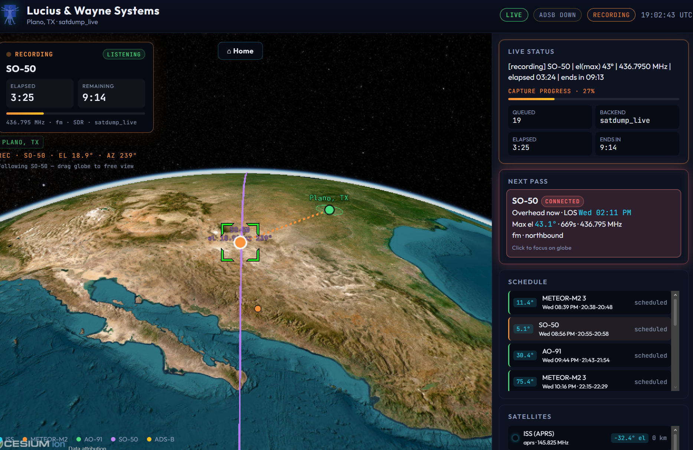

# SatTrack

A mini satellite **ground-station automation + SSA** stack. Point it at your
location, run one Python file, and it will track a fleet of satellites (ISS,
amateur birds, CubeSats, Meteor weather imagery, ...), tune an RTL-SDR **only
while a target is above the horizon**, record + decode the pass with the right
decoder for that target, and log telemetry (Doppler, SNR, pass-quality score)
to SQLite for a Grafana dashboard.

It's the Orbitron + scheduler + receiver glue replaced by a single repo.



```
python run.py        # start auto-monitoring the sky
```

---

## What it does (the pipeline)

| Stage | Module | What happens |
|-------|--------|--------------|
| TLE ingestion | `sattrack/tle.py` | Pulls GP/TLE from Celestrak for your NORAD IDs, caches by content hash, falls back to cache offline. |
| Registry | `sattrack/registry.py` | Joins TLEs with your curated freqs/decoders → authoritative `{name: {tle, freq}}`. |
| Prediction | `sattrack/predict.py` | **Skyfield** AOS / max-elevation / LOS + per-pass Doppler curve. |
| Capture + decode | `sattrack/capture.py` | Event-driven, AOS→LOS only. Default backend `satdump_live` (SatDump tunes the RTL-SDR, FM-demods, syncs APT, writes georeferenced images in one shot). Fallback `rtl_fm` (`rtl_fm \| sox` → wav → `aptdec`). |
| Telemetry | `sattrack/telemetry.py` | SQLite: passes, captures, SNR, Doppler, quality score. |
| Daemon | `sattrack/watcher.py` | Sleep-until-AOS loop that ties it all together. |

If there's no RTL-SDR (e.g. you're on Windows), it automatically runs in
**dry-run** mode: full prediction + scheduling, capture stubbed. Same code
deploys unchanged to your Kali box.

---

## Quick start

### 1. Configure your station — `config.json`

```json
{
  "observer": { "name": "Plano, TX", "latitude": 33.021746, "longitude": -96.730463, "elevation_m": 180 },
  "prediction": { "min_elevation_deg": 5.0, "horizon_hours": 24 },
  "satellites": [
    { "norad_id": 25544, "name": "ISS (APRS)",  "freq_mhz": 145.825, "decoder": "aprs" },
    { "norad_id": 57166, "name": "METEOR-M2 3", "freq_mhz": 137.9,   "decoder": "satdump", "pipeline": "meteor_m2-x_lrpt", "samplerate": 1024000 },
    { "norad_id": 43017, "name": "AO-91",       "freq_mhz": 145.96,  "decoder": "fm" }
  ]
}
```

### Targets & decoders

Each satellite's `decoder` picks how RF becomes data:

| `decoder` | Mode / tool | Good for |
|-----------|-------------|----------|
| `satdump` | SatDump live pipeline (set `pipeline`, `samplerate`) | Meteor LRPT imagery, CubeSat telemetry, HRPT, LRIT... |
| `noaa_apt` | SatDump live `noaa_apt` (legacy) | NOAA APT weather |
| `aprs` | NBFM → `atest` (direwolf) AX.25 decode | ISS digipeater (145.825), packet sats |
| `sstv` | NBFM audio → `sstv` (pysstv) image | ISS SSTV events (145.800) |
| `gr_satellites` | record (FM audio or IQ) → gr-satellites telemetry frames | AO-91 (DUV), AO-73/FUNcube (BPSK), 280+ amateur sats |
| `fm` | NBFM audio archive (no decode) | analog FM voice repeaters (SO-50), beacons |

For `gr_satellites` set `gr_name` (the gr-satellites id, e.g. `"AO-91"`, `"FUNcube-1"`)
and `mode`: `"fm"` for DUV/AFSK (decoded from FM audio) or `"iq"` for PSK/BPSK
(recorded as raw IQ via `rtl_sdr`, decoded with `--iq`). Decoded frames land as
`*.kiss` + a `*_telemetry.txt` hexdump in the pass folder.

> gr-satellites isn't on apt/PyPI/conda-forge — `bash scripts/install.sh` builds it,
> then run `bash scripts/fix_gr_satellites.sh` to wire PYTHONPATH + the launcher wrapper.
> Without it, `gr_satellites` targets record + archive their wav/IQ only.

Add any bird by NORAD ID + downlink frequency. Toggle `"enabled": false` to
park one (e.g. ISS SSTV until an event is scheduled). Browse SatDump's pipeline
IDs with `satdump pipeline --help` for `satdump` targets.

### 2. Install (Linux + RTL-SDR)

Plug in your RTL-SDR dongle, then copy-paste from the repo root:

```bash
bash scripts/install.sh
source .venv/bin/activate
python run.py doctor
```

That one script installs **everything** the stack expects:

| Component | Purpose |
|-----------|---------|
| **rtl-sdr** | Dongle drivers + `rtl_test`, `rtl_fm`, `rtl_sdr` |
| **sox** | Audio capture pipeline |
| **direwolf** / `atest` | ISS APRS / AX.25 decode |
| **SatDump** | Meteor LRPT + live satellite pipelines (builds from source if not in your repos) |
| **noaa-apt** | APT weather decode (rtl_fm fallback) |
| **meteor_demod/decode** | Meteor LRPT fallback decoder |
| **gr-satellites** | Amateur telemetry (FUNcube, AO-91, …) — built from source |
| **Kismet** | ADS-B aircraft map + background SDR consumer (SatTrack borrows the dongle only during passes) |
| **Python venv** | Skyfield, FastAPI dashboard, etc. |

Supported distros: **Debian/Ubuntu**, **Fedora/RHEL**, **Arch**, **openSUSE** (apt/dnf/pacman/zypper).
Kali works too — `bash scripts/setup_kali.sh` is just an alias for `install.sh`.

Minimal install (skip slow builds):

```bash
bash scripts/install.sh --minimal   # skips gr-satellites + meteor_demod builds
```

Windows / no SDR (prediction + dashboard dev only):

```bash
pip install -r requirements.txt
python run.py doctor    # runs in dry-run mode automatically
```

### 3. Run

```bash
python run.py doctor                 # check env + whether SDR is detected
python run.py passes                 # next 24h of passes (no capture)
python run.py doppler "NOAA 19"      # Doppler curve for its next pass
python run.py decode capture.wav     # decode an existing APT audio wav (aptdec)
python run.py                        # START auto-monitoring (the daemon)
python run.py stats                  # telemetry summary
```

Stop the daemon with `Ctrl-C`.

While running, the daemon prints a **heartbeat** status line every few seconds
so you always see it's alive — countdown to the next AOS, or live elapsed/
remaining time while recording:

```
18:50:02 INFO    sattrack.watcher: [waiting] next: NOAA 19 | AOS in 12:48 | max el 47° | 137.1000 MHz | 3 pass(es) queued
18:50:07 INFO    sattrack.watcher: [waiting] next: NOAA 19 | AOS in 12:43 | max el 47° | 137.1000 MHz | 3 pass(es) queued
...
19:02:55 INFO    sattrack.watcher: [recording] NOAA 19 | el(max) 47° | 137.1000 MHz | elapsed 02:01 | ends in 06:12
```

Tune the cadence in `config.json` → `"watcher": { "heartbeat_seconds": 5 }`.

---

## Run it as a service (Linux)

```bash
bash scripts/install_service.sh    # installs + starts satwatch.service
journalctl -u satwatch -f
```

Or manually:

```bash
sudo cp scripts/satwatch.service /etc/systemd/system/
# edit User=/paths in the unit
sudo systemctl daemon-reload
sudo systemctl enable --now satwatch
journalctl -u satwatch -f
```

---

## Sharing the RTL-SDR with Kismet

`bash scripts/install.sh` installs and configures **Kismet** automatically:
rtladsb source on your dongle, `systemctl enable kismet`, and local API at
`http://127.0.0.1:2501` (no login needed from localhost).

SatTrack **stops Kismet before each satellite pass** and **starts it again
afterward**, so one dongle can do ADS-B between passes and satellite capture
during passes. This is already wired in `config.example.json`:

```json
"sdr_sharing": {
  "enabled": true,
  "release_command": "systemctl stop kismet",
  "reacquire_command": "systemctl start kismet",
  "settle_seconds": 3,
  "watchdog": true,
  "status_command": "systemctl is-active --quiet kismet",
  "watchdog_interval_seconds": 30
}
```

Flow per pass: `release_command` → wait `settle_seconds` → capture → (always,
even on error) `reacquire_command`. Decode runs *after* the SDR is handed back
(for offline decoders).

With `watchdog` on, the daemon also keeps Kismet **up** whenever it isn't
capturing: at startup, and every `watchdog_interval_seconds`, it runs
`status_command` (exit 0 == up) and re-runs `reacquire_command` if it's down.
The watchdog never fires during a capture, so it won't fight the deliberate
`release_command`. The daemon must have rights to run these commands — run it as
root, or give it passwordless sudo / a polkit rule for `systemctl`.

Skip Kismet entirely: `bash scripts/install.sh --skip-kismet` and set
`sdr_sharing.enabled` / `kismet.enabled` to `false` in `config.json`.

## Telemetry / SSA dashboard

Everything lands in a SQLite DB (path shown by `python run.py doctor`,
default `~/SatTrack` data dir or `/var/lib/sattracker`). Tables: `passes`,
`captures`, `doppler`. Point Grafana's SQLite datasource at it, or export to
InfluxDB, and chart pass-quality score / SNR vs elevation over time.

`compute_pass_score()` blends peak elevation (60%), dwell time (40%) and
measured SNR into a 0–100 figure of merit.

### Built-in web dashboard

Real-time 3D globe with satellite tracks, next-pass reticle, schedule, and
telemetry — no Grafana required:

```bash
pip install -r requirements.txt
python run.py serve              # http://0.0.0.0:8082/
python run.py serve --port 9090  # custom port
```

Production (lucius): **https://sattracker.luciuswayne.com** via Cloudflare Tunnel → `127.0.0.1:8082`.

Run the watcher in another terminal (or as a systemd service) so the dashboard
shows live phase (waiting / recording / decoding) and capture progress:

```bash
python run.py          # daemon writes status.json on each heartbeat
python run.py serve
```

The dashboard works standalone too — it always shows predicted orbits and
schedule from cached TLEs; watcher status appears when the daemon is running.

---

## Continuous (non-pass) targets — APRS & radiosondes

Terrestrial **APRS (144.390 MHz)** and **weather balloon radiosondes
(403–406 MHz)** aren't orbital passes — they're always-on / unscheduled, so
they don't fit the predict-then-capture loop. With a single dongle they'd also
contend with satellite passes and kismet. The clean way to run them is a
dedicated always-on decoder (`direwolf` for APRS i-gate, `radiosonde_auto_rx`
for sondes) on a second SDR. Not wired into the scheduler yet — ask and it can
be added as a "fill the gaps between passes" continuous mode.

## Notes / honest scope

* This decodes **public RF** only — amateur/ISS downlinks, weather imagery,
  beacons. No classified/DARPA telemetry is involved.
* UHF birds (e.g. SO-50 @ 436 MHz) really want a directional/turnstile antenna
  and decent gain; low passes on a whip will mostly be noise.
* Single RTL-SDR is assumed → overlapping passes are handled earliest-AOS
  first; the loser is skipped (and logged).
* `fm` targets are recorded and archived (no auto-decode) — that's expected for
  voice/beacons; pull the wav into your tool of choice.

## Frequencies (quick reference)

| Target | Downlink | Decoder |
|--------|----------|---------|
| ISS APRS/packet | 145.825 MHz | `aprs` |
| ISS SSTV/voice | 145.800 MHz | `sstv`/`fm` |
| Meteor-M2 LRPT | 137.9 MHz | `satdump` |
| AO-91 (DUV telemetry) | 145.960 MHz | `gr_satellites` |
| AO-73 FUNcube (BPSK telemetry) | 145.935 MHz | `gr_satellites` (IQ) |
| SO-50 (FM voice) | 436.795 MHz | `fm` |
